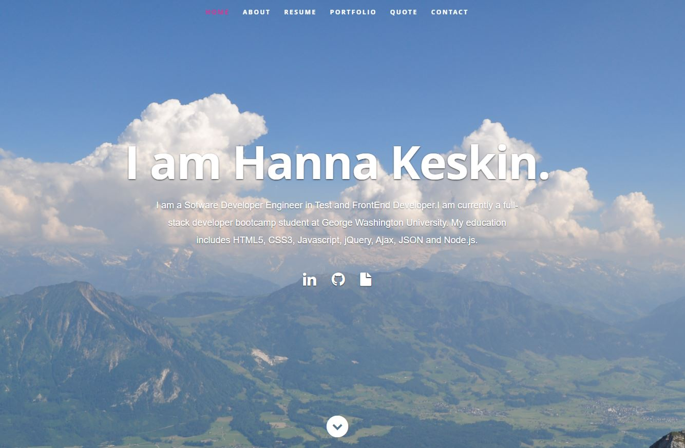
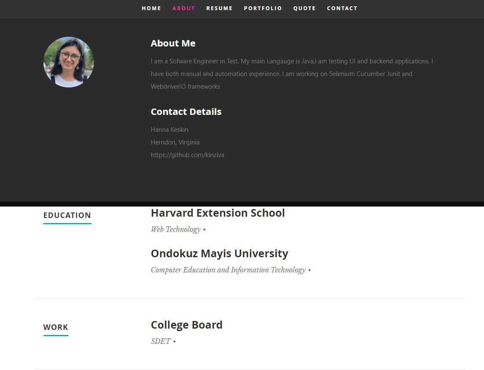
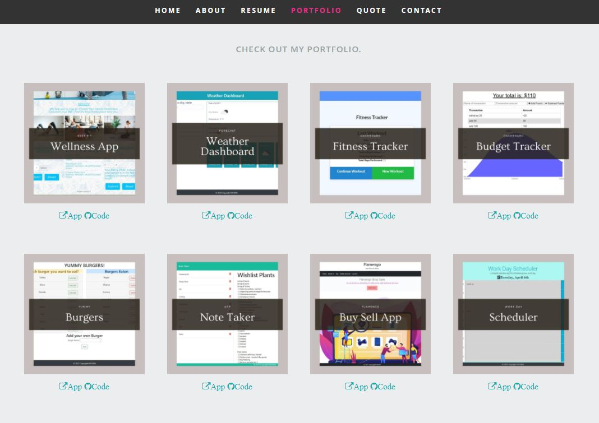
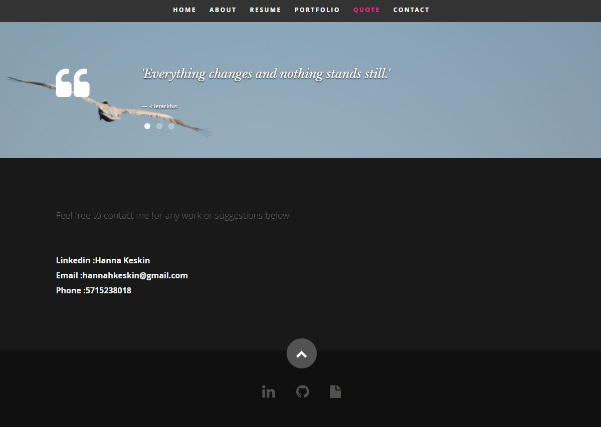

# React Portfolio

Updated portfolio using React that use some of the latest technologies.

## Screenshot

## Requirements

* A `Header` component that appears on multiple pages

* A single `Project` component that will be used multiple times on a single page 

* Navigation with React Router, dynamic rendering, or another third part router

* A `Footer` component that appears on multiple pages

* Update GitHub profile with pinned repositories featuring those same projects

* Deploy this site to GitHub Pages using the [Create React App docs for deployment.](https://create-react-app.dev/docs/deployment/#github-pages)

* **Important**: Be sure to push your codebase to GitHub and **NOT** your built and deployed code. Ensure this happens by following the above instructions and using the `gh-pages` branch to host the deployed application's code.

### Updated Portfolio

* A link to a PDF of your resume with updated projects

#### Design
* Mobile-first design

* **Important**: If you use React Router, you will **NOT** be able to use the `<BrowserRouter>` component on GitHub Pages. Read the [GitHub note on client-side routing](https://create-react-app.dev/docs/deployment/#notes-on-client-side-routing) and the [React Router documentation on HashRouter](https://reactrouter.com/web/api/HashRouter) for more information.

### Updated LinkedIn Profile 

Make sure to update your LinkedIn Profile with the new skills you've acquired since the last time it was updated.

## Table of Contents

* Title

* Description

* Screenshot

* Table of Contents

* Questions

* Urls

## Questions
Contact with me with any questions : [GitHub](https://github.com/kinziva) 

## Urls
* Repository [Repository URL ](https://github.com/kinziva/HKReactPortfolio)
* GithubPages [Repository URL ](https://kinziva.github.io/HKReactPortfolio/)

